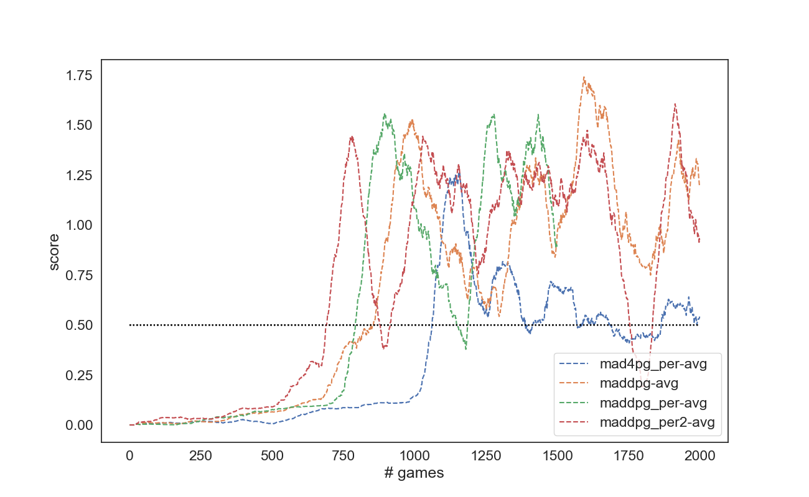

[//]: # (Image References)

[image1]: https://video.udacity-data.com/topher/2018/May/5af7955a_tennis/tennis.png "Trained Agent"

# Project 3: Collaboration and Competition

![Trained Agent][image1]

This repository contains material related to Udacity's Deep Reinforcement Learning course.

### Project Details

In this environment, two agents control rackets to bounce a ball over a net. If an agent hits the ball over the net, it receives a reward of +0.1. If an agent lets a ball hit the ground or hits the ball out of bounds, it receives a reward of -0.01. Thus, the goal of each agent is to keep the ball in play.

The observation space consists of 8 variables corresponding to the position and velocity of the ball and racket. Each agent receives its own, local observation. Two continuous actions are available, corresponding to movement toward (or away from) the net, and jumping.

The task is episodic, and in order to solve the environment, your agents must get an average score of +0.5 (over 100 consecutive episodes, after taking the maximum over both agents). Specifically,

    After each episode, we add up the rewards that each agent received (without discounting), to get a score for each agent. This yields 2 (potentially different) scores. We then take the maximum of these 2 scores.
    This yields a single score for each episode.

The environment is considered solved, when the average (over 100 episodes) of those scores is at least +0.5.

### Credit

Credit also goes to https://github.com/wpumacay/DeeprlND-projects for adapting code to implement the priority replay buffer.

### Getting Started

1. Download the environment from the link below.  You need only select the environment that matches your operating system:

    - **_Version 2: Twenty (20) Agents_**
        - Linux: [click here](https://s3-us-west-1.amazonaws.com/udacity-drlnd/P3/Tennis/Tennis_Linux.zip)
        - Mac OSX: [click here](https://s3-us-west-1.amazonaws.com/udacity-drlnd/P3/Tennis/Tennis.app.zip)
        - Windows (32-bit): [click here](https://s3-us-west-1.amazonaws.com/udacity-drlnd/P3/Tennis/Tennis_Windows_x86.zip)
        - Windows (64-bit): [click here](https://s3-us-west-1.amazonaws.com/udacity-drlnd/P3/Tennis/Tennis_Windows_x86_64.zip)
    
    (_For Windows users_) Check out [this link](https://support.microsoft.com/en-us/help/827218/how-to-determine-whether-a-computer-is-running-a-32-bit-version-or-64) if you need help with determining if your computer is running a 32-bit version or 64-bit version of the Windows operating system.

    (_For AWS_) If you'd like to train the agent on AWS (and have not [enabled a virtual screen](https://github.com/Unity-Technologies/ml-agents/blob/master/docs/Training-on-Amazon-Web-Service.md)), then please use [this link](https://s3-us-west-1.amazonaws.com/udacity-drlnd/P3/Tennis/Tennis_Linux_NoVis.zip) to obtain the "headless" version of the environment. You will not be able to watch the agent without enabling a virtual screen, but you will be able to train the agent. (To watch the agent, you should follow the instructions to enable a virtual screen, and then download the environment for the Linux operating system above.)

2. Download or clone this repository and place the Unity Tennis environment in the 'p3_collab-compet' folder of the repository and unzip (or decompress) the file. To install the dependencies needed, execute the code below in a terminal.
```bash
cd python
pip install .
```

3. Navigate to the `python/` folder. Run the file `main.py` found in the `python/` folder.

### Instructions

Running the code without any changes will start a unity session and train the multi-DDPG agent. Alternatively, you can change the agent model in the run method. The following agents are available as options:

    MADDPG
    MAD4PG


In the initialization method of main.py, you can change the type of network to run. This will take you to the 'Run' method in the maddpg and mad4pg files. In the 'Run' method, you can change the configuration and parameters for each of the networks. In the config file, you can also find addition parameters for each of the networks. 

The scores of the training will be stored in a folder called `scores`. Saved agents will be stored in a folder called `checkpoints`. After running several of the networks, you can replay the trained agent by changing the `isTest` variable from the initialization in main.py

### Report
This graph shows the scores of the various trained agents used in this project. All the networks achieved the score of +0.5 for 100 episodes. You can read more in Report.md about the comparisons and the values used to configure each.

"Scores of trained agents and rolling averages"
